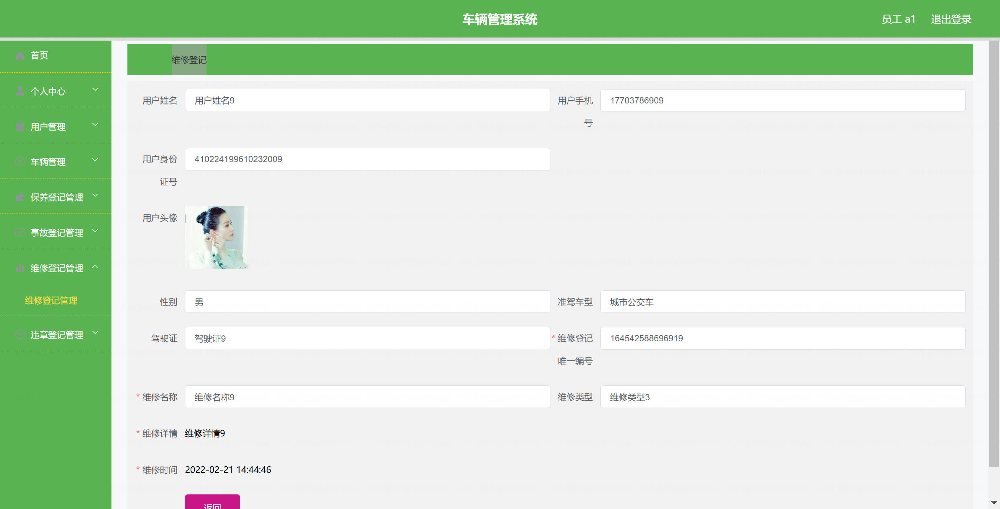

<h1 align="center">基于SpringBoot+Vue的车辆管理系统【带论文】</h1>

- <b>完整代码获取地址：从戎源码网 ([https://armycodes.com/](https://armycodes.com/))</b>
- <b>技术探讨、资料分享，请加QQ群：692619798</b>
- <b>作者微信：19941326836  QQ：952045282</b>
- <b>承接计算机毕业设计、Java毕业设计、Python毕业设计、深度学习、机器学习</b>
- <b>选题+开题报告+任务书+程序定制+安装调试+论文+答辩ppt 一条龙服务</b>
- <b>所有选题地址 ([https://github.com/Descartes007/allProject](https://github.com/Descartes007/allProject)) </b>

## 一、项目介绍

基于SpringBoot+Vue的车辆管理系统，系统角色为系统管理员、员工和用户，主要功能如下
### 系统管理员：
- 基本操作：登录、修改密码、获取个人信息、修改个人信息
- 车辆管理：筛选车辆、获取车辆列表、查看车辆详情、新增车辆、删除车辆、修改车辆、批量导入
- 保养登记管理：获取保养登记列表、筛选保养登记、查看保养登记详情、新增保养登记、删除保养登记、修改保养登记
- 维修登记管理：获取维修登记列表、筛选维修登记、查看维修登记详情、新增维修登记、删除维修登记、修改维修登记
- 违章登记管理：获取违章登记列表、筛选违章登记、查看违章登记详情、新增违章登记、删除违章登记、修改违章登记
- 事故登记管理：获取事故登记列表、筛选事故登记、查看事故登记详情、新增事故登记、删除事故登记、修改事故登记
- 用户管理（驾驶员）：筛选用户信息、获取用户列表、查看用户详情、新增用户、删除用户、修改用户
- 员工管理：筛选员工信息、获取员工列表、查看员工详情、新增员工、删除员工、修改员工、重置密码
- 系统用户管理：筛选系统用户、获取用户列表、查看用户详情、新增用户、删除用户、修改用户、重置密码
### 员工：
- 基本操作：登录、修改密码、获取个人信息、修改个人信息
- 车辆管理：筛选与本人相关车辆、获取车辆列表、查看车辆详情、新增车辆、删除车辆、修改车辆
- 保养登记管理：获取与本人相关保养登记列表、筛选保养登记、查看详情、新增保养登记、删除保养登记、修改保养登记
- 维修登记管理：获取与本人相关维修登记列表、筛选维修登记、查看详情、新增维修登记、删除维修登记、修改维修登记
- 违章登记管理：获取与本人相关违章登记列表、筛选违章登记、查看详情、新增违章登记、删除违章登记、修改违章登记
- 事故登记管理：获取与本人相关事故登记列表、筛选事故登记、查看详情、新增事故登记、删除事故登记、修改事故登记
- 用户管理（驾驶员）：筛选用户信息、查看用户详情、新增用户、删除用户、修改用户
- 用户：
- 基本操作：登录、修改密码、获取个人信息、修改个人信息
- 车辆管理：筛选本人车辆、获取车辆列表、查看车辆详情
- 保养登记管理：查看保养登记列表、查看保养登记详情、提交保养登记
- 维修登记管理：查看维修登记列表、查看维修登记详情、提交维修登记
- 违章登记管理：查看违章登记列表、查看违章登记详情
- 事故登记管理：查看事故登记列表、查看事故登记详情

## 二、项目技术

- 编程语言：Java
- 项目架构：B/S架构
- 前端技术：Vue 2、ElementUI、Vue Router、Axios、Vue-Quill-Editor
- 后端技术：Spring Boot、MyBatis、MyBatis-Plus、MySQL、Fastjson。

## 三、运行环境

- JDK版本：1.8及以上都可以
- 操作系统：Windows7/10、MacOS
- 开发工具：IDEA、Ecplise、MyEclipse都可以

## 四、数据库配置文件

- npm版本：6.14.13及以上都可以
- Redis版本：3.2.100及以上都可以
- 文件名：application.yml
- 编码类型：utf8

## 论文截图

## 系统截图

